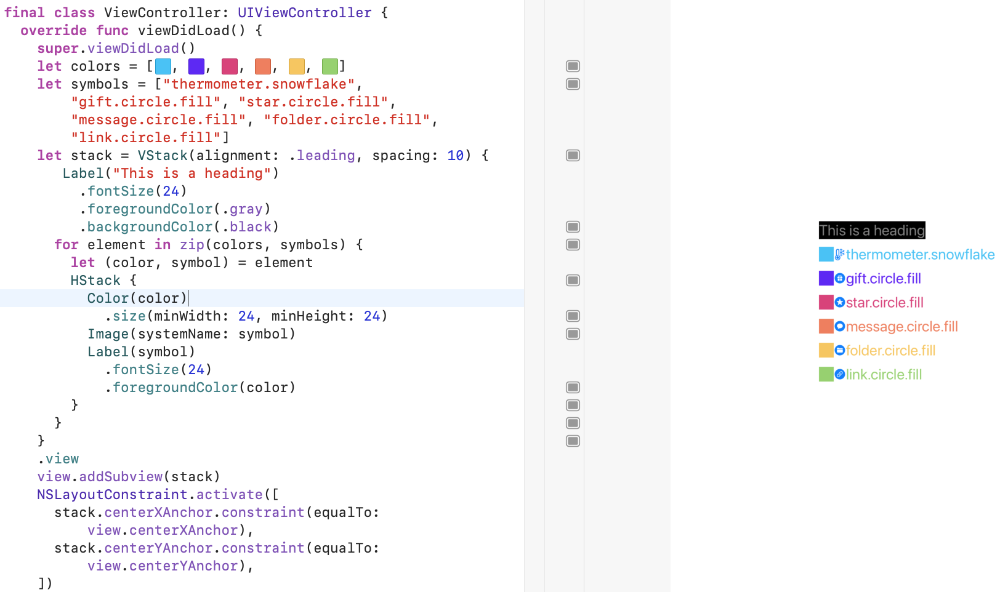

# Result builders

This repo contains the playgrounds for the March 3, 2021 meetup for Learn Swift LA / Swift Coders LA.

## StringBuilder

This playground illustrates how to make a minimally functional @StringBuilder.  We began by copying the template from SE-0289, the result builder proposal.  The minimum builder requires only the buildBlock function:
```
@resultBuilder
struct AttributedString {
  typealias Component = String
  typealias FinalResult = NSAttributedString

  static func buildBlock(_ components: Component...) -> Component {
    components.joined()
  }
}
```
We discussed that your `Component` type needs to be able to aggregate other components and represent empty values, which makes a `Collection` a natural fit for this type, although its not required.

From here we added the other component functions to enable the builder to handle conditionals, optional binding and for loops.  We then added an `Expression` as `CustomStringConvertable` and a `buildExpression` function to lift the `Expression` into a `Component`.  This enables use to use any `CustomStringConvertable` in the builder in place of a `String`.
```
  typealias Expression = CustomStringConvertible
  ...
  static func buildExpression(_ expression: Expression) -> Component {
    String(describing: expression)
  }
```
Finally we added a `FinalResult` and `buildFinalResult` and changed the type of the builder to `NSAttributedString` to show how the builder can be used to return a type that is different from its components.
```
  typealias FinalResult = NSAttributedString

  static func buildFinalResult(_ component: Component) -> FinalResult {
    NSAttributedString(string: component)
  }
```

## StackBuilder

We applied what we learned from the simple case of the StringBuilder to making a more sophisticated builder to wrap UIStackView and recover something that resemble's the beginning of SwiftUI's declarative syntax in UIKit.  Here we deployed a `ViewComponent` protocol as the `Component` for the builder to enable more functionality than we could achieve with built in types.
